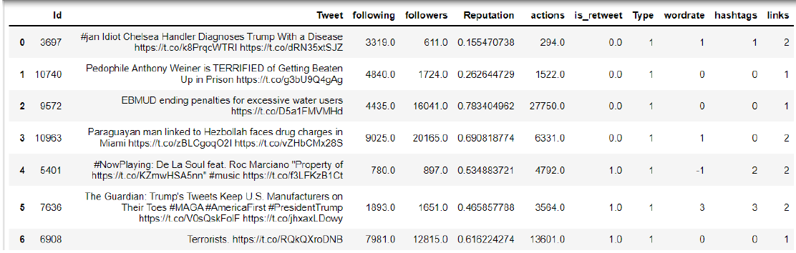
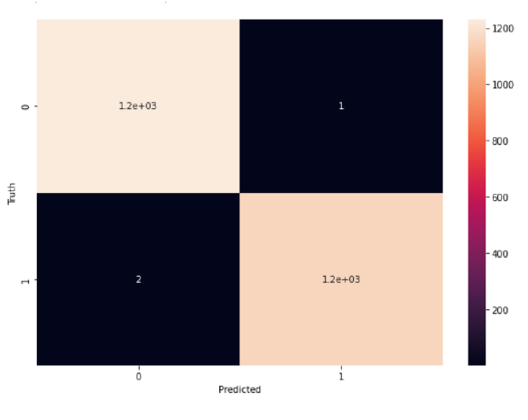

 <h1>Automatic Tweet Spam Detection using ML</h1>
  <h2>Features Used for Model Training</h2>
  
In order to train the data for the machine learning model, the features had to be extracted from the tweet text and the tweeter's account stats. The following features were used to train the model:

  <ul>
    <li>Following: the number of accounts this account follows.</li>
    <li>Followers: the number of followers this account has.</li>
    <li>Reputation: reputation = followers / (following + followers), which is less than one for spammers.</li>
    <li>Actions: The total number of favorites, replies, and retweets of said tweet.</li>
    <li>Is_retweet: If 0, it's not a retweet; if 1, it is a retweet.</li>
    <li>Wordrate: wordrate increases by 1 for every "spamword" found in the tweet and decreases by 1 for every "qualityword" found.</li>
    <li>Hashtags: the number of hashtags in the tweet.</li>
    <li>Links: the number of hyperlinks in the tweet.</li>
  </ul>
  <h3>Wordrate</h3>
  
In order to extract useful features from the tweet text, the training dataset was divided into spam and quality with almost the same number of elements in each. Next, the NLTK Natural Language ToolKit was used to parse the tweets into words and stem the words so that they can be counted. Then, the 200 most frequently occurring words were found in both lists, and the unique words from each list were separated. The frequent words in spam tweets that were not frequent in quality tweets were called "spam words", and the frequent quality words that were not frequently seen in spam tweets were called "quality words".

  
  

